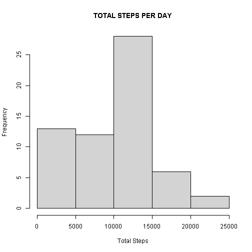
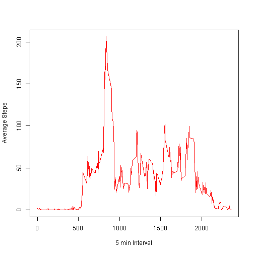
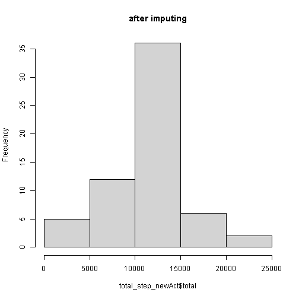
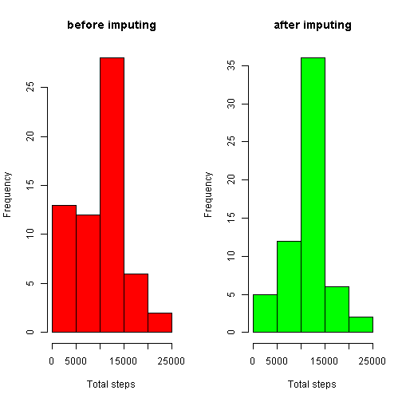
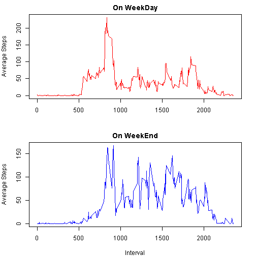

## Loading and preprocessing the data

#### Required Package

```r
library(dplyr)
library(ggplot2)
library(lubridate)
library(data.table)
```
#### downlaoding file and unzipping it

```r
file<-"https://d396qusza40orc.cloudfront.net/repdata%2Fdata%2Factivity.zip"
download.file(file,destfile = "./dataset.zip")
unzip("./dataset.zip")
```

#### reading the file and some conversion of some data

```r
activity<-read.csv("./activity.csv",sep = ",",header = T)
#conversion of column data
activity$date<-ymd(activity$date)
```

## What is mean total number of steps taken per day?

```r
#calculating total no of steps per day
total_step<-activity%>%group_by(date)%>%summarise(total=sum(steps,na.rm = T))
```

```
## `summarise()` ungrouping output (override with `.groups` argument)
```

```r
#output
head(total_step)
```

```
## Warning: `...` is not empty.
## 
## We detected these problematic arguments:
## * `needs_dots`
## 
## These dots only exist to allow future extensions and should be empty.
## Did you misspecify an argument?
```

```
## # A tibble: 6 x 2
##   date       total
##   <date>     <int>
## 1 2012-10-01     0
## 2 2012-10-02   126
## 3 2012-10-03 11352
## 4 2012-10-04 12116
## 5 2012-10-05 13294
## 6 2012-10-06 15420
```

#### histogram of the total number of steps taken each day

```r
hist(total_step$total,xlab="Total Steps",main = "TOTAL STEPS PER DAY")
```



#### Calculate and report the mean and median of the total number of steps taken per day

```r
#mean of total steps per day
print(paste0("Mean is : ",mean(total_step$total)))
```

```
## [1] "Mean is : 9354.22950819672"
```

```r
#median of total steps per day
print(paste0("median is : ",median(total_step$total)))
```

```
## [1] "median is : 10395"
```

## What is the average daily activity pattern?

Make a time series plot (i.e.type = "l") of the 5-minute interval (x-axis) and the average number of steps taken, averaged across all days (y-axis)

for this first we gone use dplyr package to do operation pipelining 
we gone create a grouping on the basis of interval on dataset then summarise it on mean basis of step

```r
Time5minInter<-activity%>%group_by(interval)%>%summarise(average_step=mean(steps,na.rm = T))
```

```
## `summarise()` ungrouping output (override with `.groups` argument)
```

```r
#view new sub data
head(Time5minInter)
```

```
## Warning: `...` is not empty.
## 
## We detected these problematic arguments:
## * `needs_dots`
## 
## These dots only exist to allow future extensions and should be empty.
## Did you misspecify an argument?
```

```
## # A tibble: 6 x 2
##   interval average_step
##      <int>        <dbl>
## 1        0       1.72  
## 2        5       0.340 
## 3       10       0.132 
## 4       15       0.151 
## 5       20       0.0755
## 6       25       2.09
```
we gone plot the graph using base ploting system over here

```r
#ploting time series graph were average steps in depend on intervals
plot(Time5minInter$average_step~Time5minInter$interval,
     type = "l",col="red",
     xlab="5 min Interval",
     ylab = "Average Steps")
```



Which 5-minute interval, on average across all the days in the dataset, contains the maximum number of steps?

```r
#max stepsin a intervals
inter<-Time5minInter[which.max(Time5minInter$average_step),]
print(paste0("interval with max step is : ",inter[,1]," ,with value : ",round(inter[,2],digits = 3)))
```

```
## [1] "interval with max step is : 835 ,with value : 206.17"
```

## Imputing missing values

the presence of missing days may introduce bias into some calculations or summaries of the data.
to eliminate/replace NAs in the dataset first we gone check the amount of NAs in a data

```r
#total no of missing values
print(paste0("total no of missing values in steps column : ",sum(is.na(activity$steps))))
```

```
## [1] "total no of missing values in steps column : 2304"
```
Now we gone create a copy of original dataset for manipulation

```r
#creating copy of original data set
newActivity<-activity
str(newActivity)
```

```
## 'data.frame':	17568 obs. of  3 variables:
##  $ steps   : int  NA NA NA NA NA NA NA NA NA NA ...
##  $ date    : Date, format: "2012-10-01" "2012-10-01" "2012-10-01" ...
##  $ interval: int  0 5 10 15 20 25 30 35 40 45 ...
```

### imputing NAs
 we gone create function which gone fetch appropriate average/mean value for a particular interval(argument) with NA to be replaced with
 for this we gone use Time5minInter dataset we created in previous question

```r
#function to fetch appropriate average/mean value for the particular interval
getMeanStep<-function(x){#x is interval argument
    m<-Time5minInter[Time5minInter$interval==x,]
    return(as.numeric(m$average_step))
}
```

now we need to checking each row in the dataset for NAs to implement it we gone use FOR LOOP STRUCTURE
in this for loop we gone iterate for each row and check whether NA exist if TRUE it will fetch the interval value for that row
and pass it to getMeanStep() function we created once the values returns from function it is assigned to appropriate row(steps)

```r
#for loop to iterate 
for (i in 1:nrow(newActivity)) {
    if(is.na(newActivity$steps[i])){#checking for NA values
        #if true send the interval to getMeanStep() function to get average step
        #and then set it to row
        newActivity$steps[i]<-getMeanStep(newActivity$interval[i])
    }
}
```
####output after removing NAs

```r
#new data set without Na
head(newActivity)#displaying new dataset
```

```
##       steps       date interval
## 1 1.7169811 2012-10-01        0
## 2 0.3396226 2012-10-01        5
## 3 0.1320755 2012-10-01       10
## 4 0.1509434 2012-10-01       15
## 5 0.0754717 2012-10-01       20
## 6 2.0943396 2012-10-01       25
```

```r
print(paste0("number of NAs : ",sum(is.na(newActivity$steps))))#print total Na values
```

```
## [1] "number of NAs : 0"
```
#### Make a histogram of the total number of steps taken each day of new dataset

```r
total_step_newAct<-newActivity%>%group_by(date)%>%summarise(total=sum(steps,na.rm = T))
```

```
## `summarise()` ungrouping output (override with `.groups` argument)
```

```r
head(total_step_newAct)
```

```
## Warning: `...` is not empty.
## 
## We detected these problematic arguments:
## * `needs_dots`
## 
## These dots only exist to allow future extensions and should be empty.
## Did you misspecify an argument?
```

```
## # A tibble: 6 x 2
##   date        total
##   <date>      <dbl>
## 1 2012-10-01 10766.
## 2 2012-10-02   126 
## 3 2012-10-03 11352 
## 4 2012-10-04 12116 
## 5 2012-10-05 13294 
## 6 2012-10-06 15420
```

```r
#histogram of the total number of steps taken each day after imputing
hist(total_step_newAct$total,main = "after imputing")
```



#### Calculate and report the mean and median total number of steps taken per day.

```r
#mean of total steps per day after imputing
print(paste0("Mean after imputing is : ",mean(total_step_newAct$total)))
```

```
## [1] "Mean after imputing is : 10766.1886792453"
```

```r
#median of total steps per day after imputing
print(paste0("median after imputing is : ",median(total_step_newAct$total)))
```

```
## [1] "median after imputing is : 10766.1886792453"
```

#### comparing old and new imputed dataset
Now lets compare this new dataset with original to check impact of imputing NAs

```r
#ploting histogram 
par(mfrow=c(1,2))
hist(total_step$total,main = "before imputing",col = "red",xlab = "Total steps")
hist(total_step_newAct$total,main = "after imputing",col = "green",xlab = "Total steps")
```



from this compair plot we can clearly understand that NAs impact on the dataset and the values clearly differes from the estimated data from original dataset. lets compare mean and median from both for dataset.

```r
compareTable<-data.frame(imputed=c(mean(total_step_newAct$total),median(total_step_newAct$total)),
                         original=c(mean(total_step$total),median(total_step$total)))
rownames(compareTable)<-c("mean","median")
print(compareTable)
```

```
##         imputed original
## mean   10766.19  9354.23
## median 10766.19 10395.00
```
Has we see in this outputs there is clearly changes in graph as well as in the mean and median after imputing.
the new datasets mean and median are near equal.

## Are there differences in activity patterns between weekdays and weekends?
#### Create a new factor variable in the dataset with two levels – “weekday” and “weekend” indicating whether a given date is a weekday or weekend day.

for this first we have to add new column/variable to be assigned has factor
using ifelse we check for each date in date columns weekday using weekdays() function and appropriatly assign with
**weekday** or **weekend** then we make that column has factor using as.factor() function were levels is set has weekday and weekend

```r
#adding factor to dataset on basis of weekday and weekend
newActivity$days<-ifelse(weekdays(newActivity$date) %in% c("Saturday","Sunday"),"weekend","weekday")
newActivity$days<-as.factor(newActivity$days)
#visualizing factors in dataset
table(newActivity$days)
```

```
## 
## weekday weekend 
##   12960    4608
```
now we subset the dataset according to weekday and weekend using dplyrs filter() function

```r
WeekdayData <- filter(newActivity, newActivity$day == "weekday")
WeekendData <- filter(newActivity, newActivity$day == "weekend")
```
Now on this subset we create a dataset for 5 min interval and average steps

```r
#generating dataset on 5 min interval and average steps for weekday and weekend
totStepWD<-WeekdayData%>%group_by(interval)%>%summarise(avg_step=mean(steps,na.rm = T))
```

```
## `summarise()` ungrouping output (override with `.groups` argument)
```

```r
totStepWE<-WeekendData%>%group_by(interval)%>%summarise(avg_step=mean(steps,na.rm = T))
```

```
## `summarise()` ungrouping output (override with `.groups` argument)
```
#### Make a panel plot containing a time series plot (i.e. type = "l") of the 5-minute interval (x-axis) and the average number of steps taken, averaged across all weekday days or weekend days (y-axis).

for this panel we gone use base ploting with par() function to set global setting for the panel graph

```r
#ploting
par(mfrow=c(2,1),mar=c(4,4,2,2))
plot(totStepWD$avg_step~totStepWD$interval,
     col="red",type="l",main="On WeekDay",
     xlab="",ylab = "Average Steps")
plot(totStepWE$avg_step~totStepWE$interval,
     col="blue",type="l",main="On WeekEnd",
     xlab="Interval",ylab = "Average Steps")
```



From this Panel we clear draw conclusion that on Weekday the activity is high then compared to Weekend during certain time interval .since on weekday people tends goto jobs and other activities then rest of the day being on desk or sitting in office/school ,while on weekdays staying indoor most of the times

